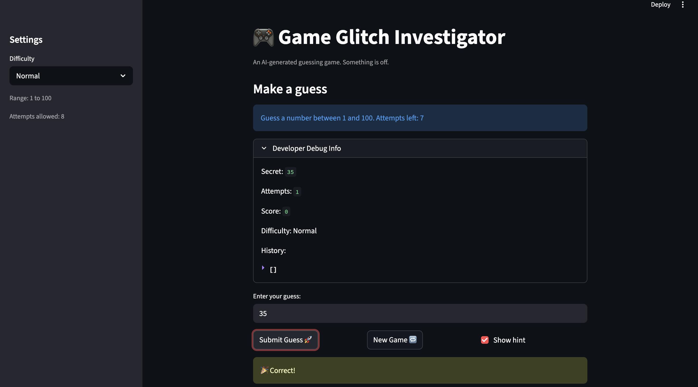

# 🎮 Game Glitch Investigator: The Impossible Guesser

## 🚨 The Situation

You asked an AI to build a simple "Number Guessing Game" using Streamlit.
It wrote the code, ran away, and now the game is unplayable. 

- You can't win.
- The hints lie to you.
- The secret number seems to have commitment issues.

## 🛠️ Setup

1. Install dependencies: `pip install -r requirements.txt`
2. Run the broken app: `python -m streamlit run app.py`

## 🕵️‍♂️ Your Mission

1. **Play the game.** Open the "Developer Debug Info" tab in the app to see the secret number. Try to win.
2. **Find the State Bug.** Why does the secret number change every time you click "Submit"? Ask ChatGPT: *"How do I keep a variable from resetting in Streamlit when I click a button?"*
3. **Fix the Logic.** The hints ("Higher/Lower") are wrong. Fix them.
4. **Refactor & Test.** - Move the logic into `logic_utils.py`.
   - Run `pytest` in your terminal.
   - Keep fixing until all tests pass!

## 📝 Document Your Experience

### Game Purpose
The purpose of this game is to guess a secret number between 1 and 100 within a limited number of attempts. The game provides hints such as "Higher" or "Lower" to help the player get closer to the correct number. It is designed to demonstrate debugging, game logic, and how state works in a simple interactive application.

### Bugs Found
While testing the game, several issues were identified. The secret number changed every time the "Submit" button was clicked because the variable storing the number was being reset. This made it impossible to correctly track guesses. Another issue was that the "Higher" and "Lower" hints were sometimes incorrect due to flawed comparison logic. Additionally, some logic was mixed between files, which made the code harder to maintain and test.

### Fixes Applied
To fix these issues, the secret number was stored properly so it would not reset every time the player made a guess. The hint logic was corrected so that the game accurately tells the player whether the secret number is higher or lower than the guess. The game logic was also refactored by moving reusable functions into `logic_utils.py`, improving code organization and making the project easier to test and maintain.

## 📸 Demo

### Winning Game Screenshot

## 🚀 Stretch Features

- [ ] [If you choose to complete Challenge 4, insert a screenshot of your Enhanced Game UI here]
